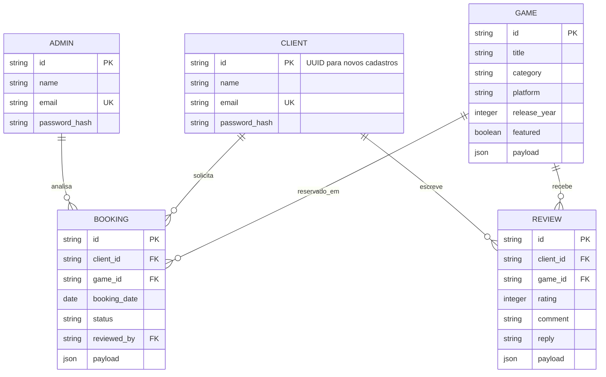

# Modelo Entidade-Relacionamento — GameVault

O sistema tem cinco entidades persistidas no PostgreSQL: administradores, clientes, jogos, empréstimos e avaliações. Empréstimos e avaliações ligam clientes aos jogos; a decisão do empréstimo também referencia o administrador que a tomou.

O DDL executável está em [schema.sql](../db/schema.sql). IDs administrativos legados são mantidos como `TEXT`; novos clientes continuam recebendo UUIDs no backend.
